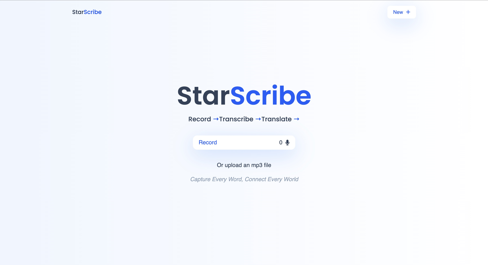

# 🌟 StarScribe

**StarScribe** is a sleek and intuitive web app that allows users to **record or upload audio**, get it **transcribed to text**, and optionally **translate the transcription** into multiple languages. Designed with accessibility and simplicity in mind, StarScribe is the perfect tool for students, journalists, creators, and global communicators.

---

## 🚀 Features

- 🎤 Record live audio directly in the browser
- 📁 Upload audio files (e.g., .mp3, .wav)
- ✍️ Transcribe audio using advanced speech recognition
- 🌍 Translate transcriptions into many supported languages
- 📋 Copy, edit, and download your transcripts
- 📱 Clean and responsive user interface

---

## 🖼️ UI Preview




---

## 🛠️ Built With

- **React** (Frontend)
- **JavaScript / TypeScript**
- **Web Workers** for background processing
- **Whisper / Whisper.cpp**
- **Tailwind CSS** 
- **Vite**

---

## 📦 Getting Started

### Prerequisites

- Node.js >= 16
- npm or yarn

### Installation

```bash
git clone https://github.com/yourusername/StarScribe.git
cd StarScribe
npm install
npm run dev

